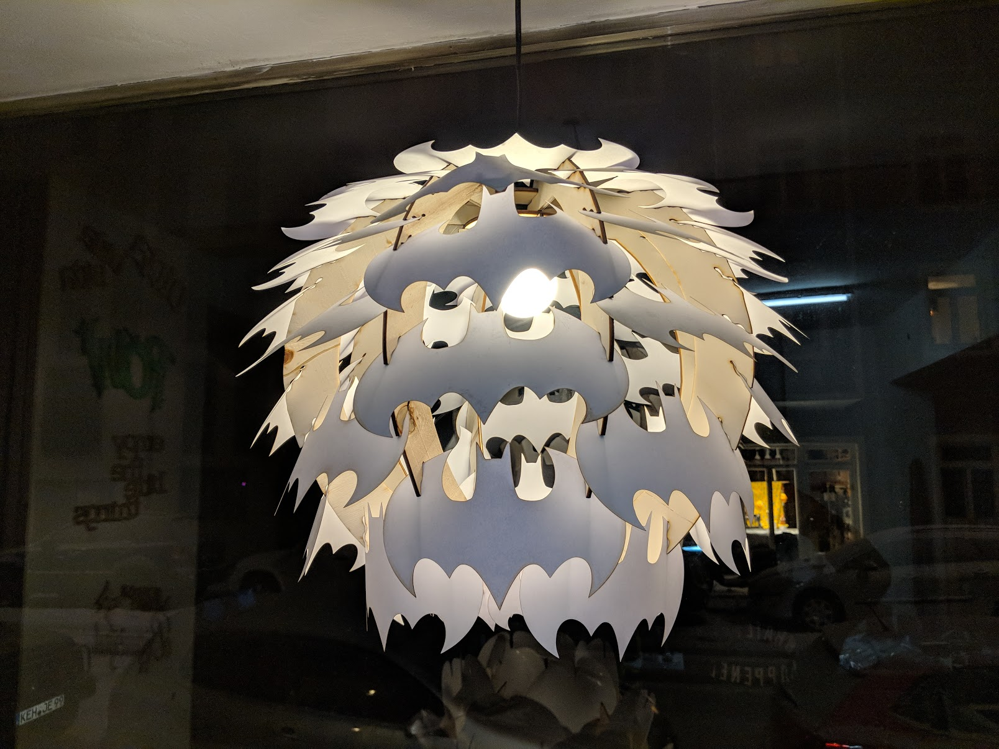
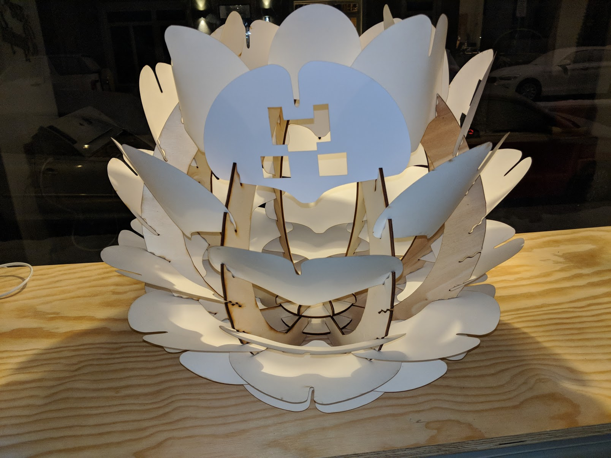
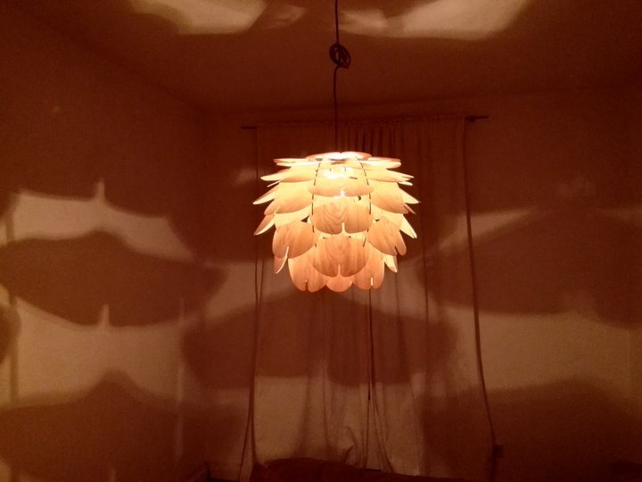
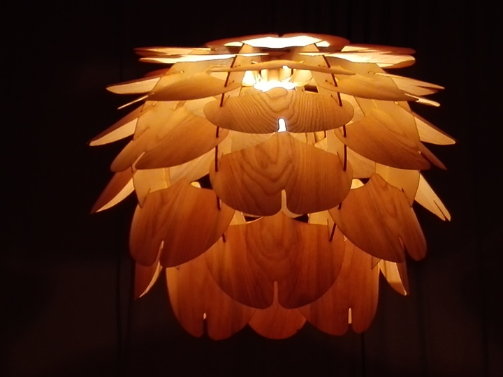
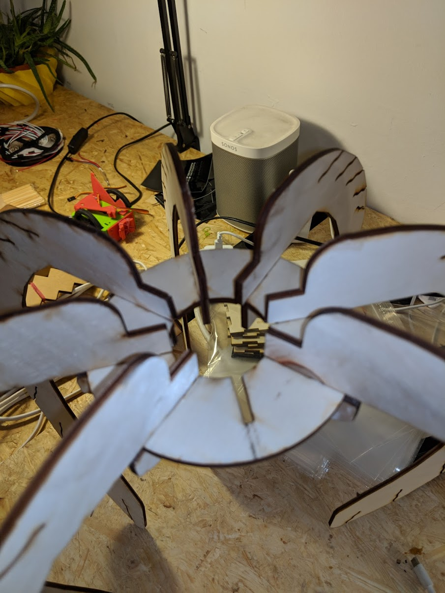
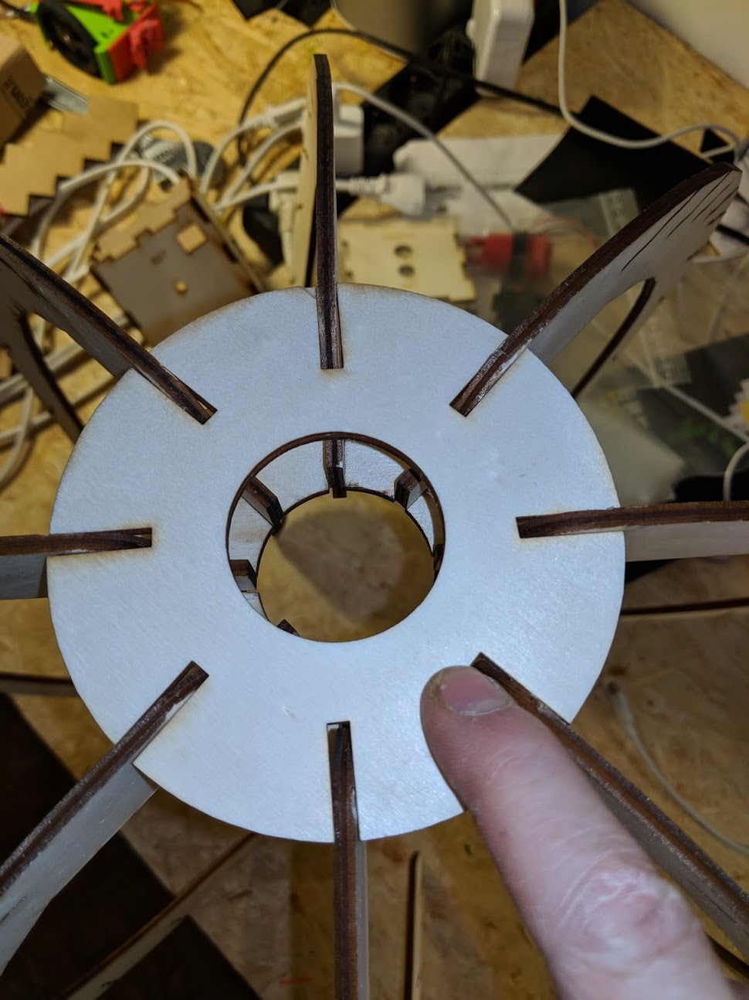

# woodlight // Batman Light // creeper light

Holzleuchte aus Birkensperrholz und Eschenfurnier. Inspiriert durch [VITA copenhagen](https://www.vitacopenhagen.com/# "VITA copenhagen").

Es gibt mittlerweile eine Batman version und eine Creeper Version von Andreas.

Shortlink: https://git.io/vxqLZ

Read this in other languages: [English](README.en.md)

<<<<<<< HEAD

 
 
## Versions

* Esche
* Papier
* Batman
* Creeper

## Bauteile

* 8 Rippen
* 2 verschiedene Ringe
* 40 große Blätter
* 4 oder wahlweise 8 kleine Blätter.

## Bauanleitung

Stecke erst die Rippen in den Kreis der die Öffnungen innen hat. Gehe sicher, dass die Rippen bis nach Hinten durchgeschoben sind, sodass es wieder ein Kreis innen zu sehen ist. Stecke dann vorsichtig den zweiten Kreis darauf und drücke ihn nacheinander nach unten. Davor solltest du deine Lampenfassung in den Kreisstecken.

Danach kannst du die Blätter reinstecken.

## Designer

Mini Revollo

[mini@erfindergarden.de](mailto:mini@erfindergarden.de)

## Credits erfindergarden

Umgesetzt wurde die Leuchte im [erfindergarden](http://www.erfindergarden.de) in München.

[www.erfindergarden.de](http://www.erfindergarden.de)

[www.facbebook.com/erfindergarden](http://www.facbebook.com/erfindergarden)

## License

This project is [Attribution-ShareAlike 2.5 Generic (CC BY-SA 2.5)](https://creativecommons.org/licenses/by-sa/2.5/). You can do anything what you want with it but please say that you got the original design from erfindergarden and als share it under the same license. 

Der Prototyp war mit Papier 120 Gramm gefertigt. Sieht auch sehr schön aus. Die Einschnitte in den Rippen müssen hierfür aber geschmälert werden. Achtung bitte die Datei **woodlight_Rippe_36_v_1_Papier.svg** verwenden. 

Ansonsten fallen die Papierblätter aus den Einschnitten.

For more information, see [license](LICENSE.md). 
	

